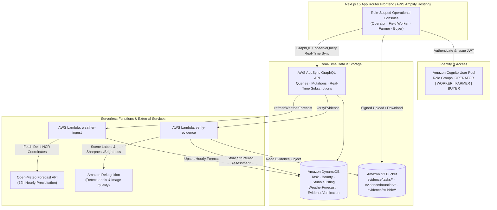

# AQUILOOP

**Circular Water, Flood & Agricultural Residue Resilience Platform for Delhi NCR**

[](https://nextjs.org/)
[](https://www.typescriptlang.org/)
[](https://docs.amplify.aws/)
[](https://main.d34nn6kyvzewoi.amplifyapp.com)

AQUILOOP coordinates pre-monsoon drainage readiness, community-verified flood-waste clearance, and agricultural crop-residue recovery across Delhi NCR. Built on Next.js App Router and AWS Amplify Gen 2, the platform connects municipal operators, field workers, farmers, and biomass buyers around a shared operational workflow: **Predict → Act → Verify → Measure Impact**.

- **Live Application:** [https://main.d34nn6kyvzewoi.amplifyapp.com](https://main.d34nn6kyvzewoi.amplifyapp.com)
- **Repository:** [https://github.com/Krrish0621/AQUILOOP](https://github.com/Krrish0621/AQUILOOP)

---

## Core Modules

### 1. MONSOONLOOP — Pre-Rain Flood Intelligence & Crew Dispatch
- Ingests 72-hour hourly precipitation and rain-probability forecasts for Delhi NCR corridors (**Mayapuri**, **Rohini**, **Najafgarh**, **Vasant Kunj**) via Open-Meteo and persists time-series records in Amazon DynamoDB.
- Computes composite zone flood risk scores by comparing forecast peak rainfall (`mm/hr`) against configured corridor drainage capacity thresholds and blocked-drain counts.
- Enables municipal operators to inspect drainage assets on an interactive MapLibre map, generate pre-storm action plans, and dispatch municipal field crews with real-time task status tracking (`PENDING` → `ASSIGNED` → `IN_PROGRESS` → `SUBMITTED` → `VERIFIED` / `FAILED`).

### 2. FLOOD & WASTE BOUNTIES — Drain Blockage Clearance & Evidence Verification
- Publishes geo-tagged solid-waste and plastic drain-clearance bounties across flood-prone Delhi corridors ahead of heavy rainfall windows.
- Field workers claim open bounties, execute clearance work on site, and upload before/after photographic evidence to Amazon S3.
- Municipal operators review side-by-side S3 evidence images alongside automated Amazon Rekognition scene-label and image-quality analysis before approving or rejecting submissions and issuing **AQUILOOP Resilience Credits (ARC)**.

### 3. STUBBLE-TO-WATER EXCHANGE — Agricultural Residue Marketplace
- Connects Delhi NCR and peri-urban farmers (**Najafgarh**, **Narela**, **Bawana**, **Alipur**, **Rohini**, **Ghaziabad**, **Noida**, **Sonipat**, **Bahadurgarh**) with biomass buyers to recover paddy straw and wheat stubble before open-field burning occurs.
- Supports the full residue recovery lifecycle (`OPEN` → `ACCEPTED` → `SCHEDULED` → `IN_TRANSIT` → `PICKED_UP` → `PENDING_VERIFICATION` → `VERIFIED` / `REJECTED`) with S3 pickup-proof uploads, AI-assisted image inspection, and ARC ledger tracking.

---

## Role Workflows

AQUILOOP enforces role-specific workspaces and data permissions through Amazon Cognito user groups and AWS AppSync authorization rules:

| Role | Primary Modules | Key Responsibilities |
| :--- | :--- | :--- |
| **Operator** (`OPERATOR`) | Home Overview, `MONSOONLOOP`, `Flood & Waste Bounties`, `Stubble-to-Water Exchange` | Refresh 72-hour weather forecasts, monitor zone flood risk, dispatch municipal crews, publish cleanup bounties, inspect S3 photographic evidence with AI scene analysis, and approve or reject bounty and stubble pickup verifications. |
| **Field Worker** (`WORKER`) | `MONSOONLOOP` (Assigned Tasks), `Flood & Waste Bounties` | Open directly into assigned pre-storm drainage tasks, update field execution status, claim self-directed Flood & Waste Bounties, and upload before/after S3 photographic evidence. |
| **Farmer** (`FARMER`) | `Stubble-to-Water Exchange` (Farmer Workspace) | List unburned crop residue lots with tonnage, crop type, moisture/baling condition, and pickup window; track buyer acceptance, collection progress, and verified ARC rewards. |
| **Buyer** (`BUYER`) | `Stubble-to-Water Exchange` (Buyer Workspace) | Browse open Delhi NCR residue listings, accept and schedule farm-gate pickups, advance transit status, and upload S3 weighbridge/pickup proof for operator verification. |

---

## System Architecture



---

## Technology Stack

- **Frontend:** Next.js 15.2 (App Router), React 19, TypeScript 5.8, Tailwind CSS, Radix UI Primitives, Lucide Icons
- **Geospatial & Visualization:** MapLibre GL JS, Recharts
- **Cloud Backend (AWS Amplify Gen 2):**
  - **Authentication:** Amazon Cognito User Pool & Role Groups (`OPERATOR`, `WORKER`, `FARMER`, `BUYER`)
  - **API & Real-Time Sync:** AWS AppSync GraphQL with `observeQuery()` subscriptions and background state synchronization
  - **Database:** Amazon DynamoDB (`Task`, `Bounty`, `StubbleListing`, `WeatherForecast`, `EvidenceVerification`)
  - **Storage:** Amazon S3 (`aquiloop-evidence-storage`) with path-scoped role permissions
  - **Compute & AI:** AWS Lambda (Node.js 20), Open-Meteo Forecast API integration, Amazon Rekognition (`DetectLabels`)

---

## Local Development Setup

### Prerequisites
- **Node.js** 20+ and **npm**
- An **AWS account** configured locally via AWS CLI (`aws configure`) if deploying or running an Amplify Gen 2 cloud sandbox

### 1. Install Dependencies
```bash
git clone https://github.com/Krrish0621/AQUILOOP.git
cd AQUILOOP
npm install
```

### 2. Configure Environment Variables
Copy the reference environment file to `.env.local`:

```bash
cp .env.example .env.local
```

Review `.env.example` and configure `.env.local` for your environment:

| Variable | Description |
| :--- | :--- |
| `AWS_REGION` | Target AWS region when running server-side scripts (e.g., `ap-southeast-2`). |
| `AWS_ACCESS_KEY_ID` | Optional local AWS SDK credentials (if not using default `~/.aws/credentials` profile). |
| `AWS_SECRET_ACCESS_KEY` | Optional local AWS SDK secret key. |
| `NEXT_PUBLIC_AWS_ENABLED` | Set to `"true"` when `amplify_outputs.json` is present. |
| `AQUILOOP_DEMO_PASSWORD` | Local development password used by `npm run seed:users` and the local demo role switcher. Never commit `.env.local`. |

### 3. Generate or Connect Amplify Backend Outputs
Start an Amplify Gen 2 cloud sandbox (or generate `amplify_outputs.json` from an existing Amplify branch deployment):

```bash
npx ampx sandbox
```

### 4. Seed Demo Accounts and Sample Operational Data (Optional)
Once `amplify_outputs.json` and `AQUILOOP_DEMO_PASSWORD` in `.env.local` are configured:

```bash
npm run seed:users
npm run seed
```

### 5. Run the Development Server
```bash
npm run dev
```

Open `http://localhost:3000` in your browser.

### 6. Typechecking and Production Build
```bash
npm run typecheck
npm run build
```

---

## Deployment

- **Production URL (AWS Amplify Hosting):** [https://main.d34nn6kyvzewoi.amplifyapp.com](https://main.d34nn6kyvzewoi.amplifyapp.com)
- **GitHub Repository:** [https://github.com/Krrish0621/AQUILOOP](https://github.com/Krrish0621/AQUILOOP)

The production application is deployed via **AWS Amplify Hosting** (`WEB_COMPUTE` SSR) connected to the `main` branch. On every push to `main`, AWS Amplify provisions/updates the full-stack backend resources (`npx ampx pipeline-deploy`), generates `amplify_outputs.json`, and builds the Next.js production bundle (`npm run build`), as defined in [`amplify.yml`](./amplify.yml).

---

## Security & Operational Boundaries

- **Human-in-the-Loop Verification:** The **Operator** role remains the sole final authority for approving or rejecting field task completions, flood-bounty claims, and stubble pickup proofs.
- **Assistive AI Analysis:** Automated evidence checks powered by Amazon Rekognition evaluate visual scene labels, image sharpness/brightness, and before/after overlap to assist operator review; AI output never auto-approves or auto-rejects payouts.
- **Non-Monetary Resilience Credits (ARC):** AQUILOOP Resilience Credits (`ARC`) are internal environmental accounting points used to track verified resilience contributions and do not represent fiat currency or financial instruments.
- **Credential Hygiene:** `.env*` files, `amplify_outputs*.json`, and private credentials are excluded from version control via [`.gitignore`](./.gitignore).
